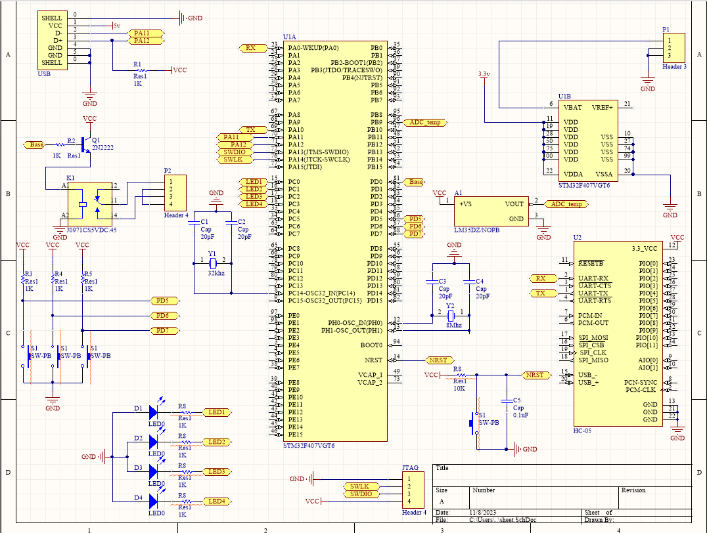
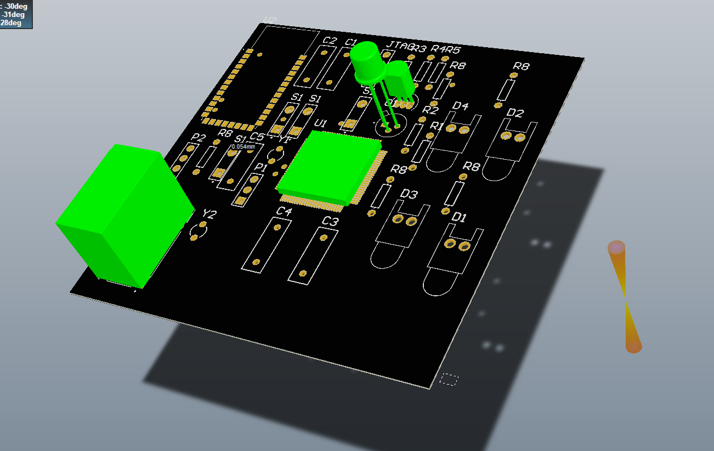

# stm32_custom_circuit

this circuit is composed of STM32F407VGT6 chip , a bluetooth module hc-05 , 4 LEDs, 3 push-buttons, a tempeture sensor LM35 and a relay 

# this is the shematic diagram

# this is the pcb circuit
